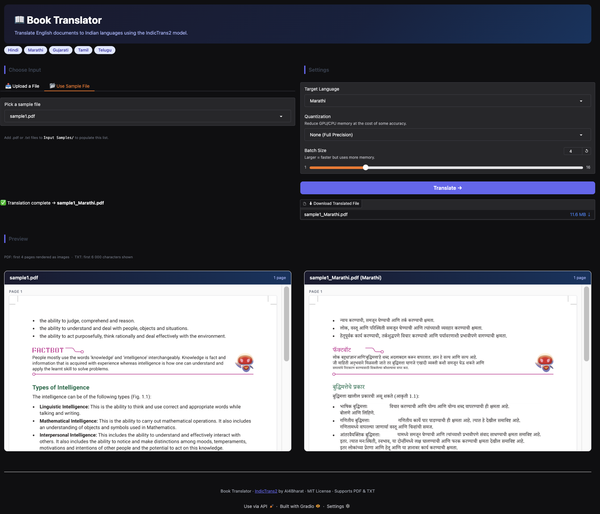
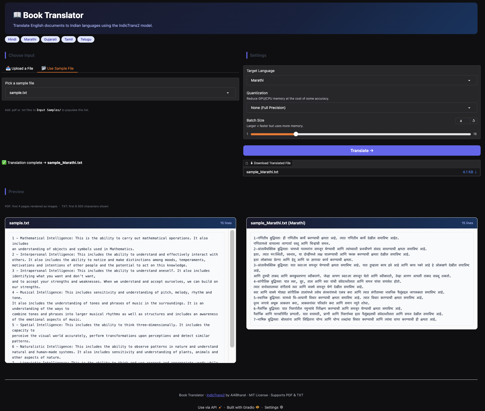

# Book Translator

A powerful machine learning-based tool for translating books and documents from English to various Indian languages using the IndicTrans2 model.

## Try it Now

- **Colab Notebook:** [Open in Colab](https://colab.research.google.com/drive/1ijcrRp1mohambZWi1rp9DiNqR9FKkJ0F?usp=sharing)
- **Gradio Demo (Colab):** [Launch Gradio Demo](https://colab.research.google.com/drive/1Heo4jzo0PnGBksxlaMT9sWVyoGOJSuzo?usp=sharing)

## Screenshots




## Features

- **High Quality Translation:** Uses AI4Bharat's IndicTrans2 for state-of-the-art results.
- **Format Preservation:** Keeps PDF layout and formatting intact during translation.
- **Side-by-Side Preview:** Review original and translated content simultaneously.
- **Multiple Formats:** Supports PDF and TXT files.
- **Quantization Support:** 4-bit and 8-bit options for lower memory usage.

## Supported Languages

Here is the list of languages supported by the IndicTrans2 models:

| Language | Code | Language | Code |
| --- | --- | --- | --- |
| Assamese | asm_Beng | Kashmiri (Arabic) | kas_Arab |
| Bengali | ben_Beng | Kashmiri (Devanagari) | kas_Deva |
| Bodo | brx_Deva | Maithili | mai_Deva |
| Dogri | doi_Deva | Malayalam | mal_Mlym |
| English | eng_Latn | Marathi | mar_Deva |
| Gujarati | guj_Gujr | Manipuri (Bengali) | mni_Beng |
| Hindi | hin_Deva | Manipuri (Meitei) | mni_Mtei |
| Kannada | kan_Knda | Nepali | npi_Deva |
| Odia | ory_Orya | Punjabi | pan_Guru |
| Sanskrit | san_Deva | Santali | sat_Olck |
| Sindhi (Arabic) | snd_Arab | Sindhi (Devanagari) | snd_Deva |
| Tamil | tam_Taml | Telugu | tel_Telu |
| Urdu | urd_Arab | Konkani | gom_Deva |

## Model Details & Access

The project uses the AI4Bharat/IndicTrans2 model:
- **Hugging Face Model:** [ai4bharat/indictrans2-en-indic-1B](https://huggingface.co/ai4bharat/indictrans2-en-indic-1B)

**Note:** You need to request access to the Hugging Face repository and provide your HF Token in the environment variables (`HF_TOKEN`) to download and use the model.

## Libraries Used

- **Transformers:** For model loading and inference.
- **IndicTransToolkit:** For preprocessing and postprocessing.
- **Gradio:** For the user interface.
- **PyMuPDF (fitz):** For PDF handling and rendering.
- **Torch:** For computation.
- **BitsAndBytes:** For 4/8-bit quantization.

## Project Structure

```
Book-Translator/
├── app.py                   # Gradio application
├── Book-Translator.ipynb    # Main notebook with translation code
├── Input Samples/          # Sample input files
├── screenshots/            # UI demo images
└── README.md
```

## License

This project is released under the MIT License. IndicTrans2 model is also released under the MIT License by AI4Bharat.

---

**Personal Note :** This project is made as a PoC for FutureGen Innovation Lab. [Certificate Link](https://www.linkedin.com/posts/lokesh-kudipudi_thrilled-to-have-successfully-completed-the-activity-7305805846532304896-v1RC?utm_source=share&utm_medium=member_desktop&rcm=ACoAAESoDDAB-qA2H6o7yBATiUQ2QQANQRGYYpY)